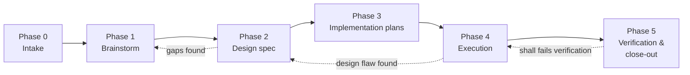

# The Project-Creation Roadmap

How an idea becomes a shipped project or feature, using an AI coding
assistant as the primary code writer. Six phases; each has an entry
condition, produces one artifact, and ends at a gate. The engineer owns
every gate.

The chain is traceable end to end: requirement IDs (Phase 0) are cited by the
design spec (Phase 2), covered by plans (Phase 3), and checked off one by one
at verification (Phase 5).

---

## Phase 0 — Intake *(engineer, no AI required)*

**Entry:** an idea worth building — a new project or a feature on an
existing system.

**Do:** copy `INTAKE-TEMPLATE.md`, fill it out. State the problem, scope,
numbered requirements (shall/should/may), constraints, applicable standards,
and interfaces. Push genuine unknowns into §10 Open Questions instead of
guessing — a rich §10 is what makes the next phase sharp.

**Artifact:** a filled requirements sheet, status *Issued for Design*.

**Gate:** every *shall* has a verification method; everything you don't know
is in §10, not silently omitted.

## Phase 1 — Brainstorm *(engineer + AI, dialogue)*

**Entry:** the filled sheet, loaded into the AI session at the start.

**Do:** ask the assistant to brainstorm the design from the sheet (with
Claude Code + Superpowers, the brainstorming skill picks it up). The
dialogue should probe §10 Open Questions, surface gaps and contradictions in
the sheet, and propose 2–3 architectures with trade-offs. It should NOT
re-ask what the sheet answers.

**Artifact:** an agreed design direction, presented in session.

**Gate:** the engineer approves the presented design. If the dialogue exposed
wrong or missing requirements, update the sheet (bump the revision) before
moving on.

## Phase 2 — Design spec *(AI writes, engineer reviews)*

**Entry:** approved design direction.

**Do:** the assistant writes the design spec — architecture, components, data
flow, error handling, testing approach — citing requirement IDs so each
decision traces to a requirement. Any *should* it declines to satisfy gets a
documented justification.

**Artifact:** `YYYY-MM-DD-<topic>-design.md`, wherever your team keeps
design documents.

**Gate:** engineer reviews the file. Every in-scope *shall* is addressed or
explicitly deferred with justification.

## Phase 3 — Implementation plans *(AI writes, engineer reviews)*

**Entry:** approved design spec.

**Do:** decompose the design into numbered implementation plans small enough
to execute and review independently. Each plan opens with a Problem statement
(the why), then the work. Order plans by dependency.

**Artifact:** `YYYY-MM-DD-plan-N-<topic>.md` files.

**Gate:** plans collectively cover all in-scope requirements; no plan
depends on a later one.

## Phase 4 — Execution *(AI writes code, engineer reviews checkpoints)*

**Entry:** approved plans.

**Do:** execute plans in order on a dedicated feature branch or worktree —
one branch per feature, never committing to the default branch directly
(`STANDARDS.md` VCS). The first
plan establishes the day-0 essentials per `STANDARDS.md` — README,
docstrings and type hints with a type checker in CI, a version-pinned
formatter/linter in CI, unit tests with CI, structured logging, and the
self-documenting structure (per-package READMEs + auto-generated code map,
enforced in CI) — these are never bolted on later. Findings that
invalidate a plan flow back into the plan (pre-v0) or the issue tracker
(post-v0); findings that invalidate the *design* send you back to Phase 2.

**Artifact:** working code on the branch, tests green.

**Gate:** all plan checkpoints reviewed; test suite passes.

## Phase 5 — Verification & close-out *(engineer + AI)*

**Entry:** execution complete, tests green.

**Do:** walk the requirement tables (§4, §5) row by row and verify each
*shall* by its declared method — Test, Demonstration, Inspection, or
Analysis — including the day-0 standards cited in §7 (`STANDARDS.md`
DOC/CODE/TST/LOG). Record the result against each ID. Document any *should*
deviations. Then integrate — the route (merge into the default branch with
`--no-ff`, or open a pull request for review) is an explicit choice made with
the engineer, never assumed (`STANDARDS.md` VCS-006) — tag the merge point if
your team tags, and mark the sheet's status *Implemented*.

**Artifact:** verification record (a checked-off copy of the requirement
tables is enough); merged code.

**Gate:** every *shall* verified; the acceptance criteria in §9 demonstrably
hold.

---

## Feature work on an existing system

Same loop, Feature mode: the sheet's **Target system** names what you're
changing, §8 records which existing behaviors must not change, and Phase 4
runs on a branch of the existing repo. Small features may compress Phases
2–3 into a single short spec-plan — but never skip Phase 0; the ten minutes
spent filling the sheet is what keeps a "small" feature from quietly growing.

## Revision discipline

The requirements sheet is a living document with a revision letter. When any
phase changes a requirement, update the sheet and bump the revision — the
sheet must always reflect what is actually being built, because Phase 5
verifies against the sheet, not against memory.
